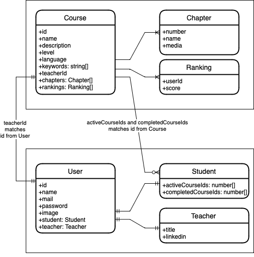

# Henry Challenge by Agustín Prado.

## Installation
```bash
# install docker. On Mac:
$ brew install --cask docker

# install dependencies
$ npm install
```

## Running the app

```bash
# open docker. On Mac:
$ open -a Docker

# start docker instance with mongoDB
$ npm run start:db

# initiate watch mode
$ npm run start:dev

# kill docker. On Mac:
$ pkill -SIGHUP -f /Applications/Docker.app 'docker serve'
```

## Test

```bash
# run unit tests
$ npm run test

# check test coverage
$ npm run test:cov
```

## Swagger UI

```bash
# use UI
$ http://localhost:3000/docs

# get JSON
$ http://localhost:3000/docs-json
```

## Database Diagram


## Concerns
- Completed chapters in active courses are not being tracked.
- Every user can be a Student, a Teacher or both.
- Ranking will appear for both active and completed courses. An upgrade could be allowing only for completed and/or handling ranking at chapter level, instead of course level.
- Unit tests won't cover all possible scenarios, but will cover basic functionality.
- Unit tests won't cover controllers, main nor parse object pipe.
- Using `mongodb-memory-server` to launch an memory-based MongoDB instance for testing.
- Passing all the ranking data due to it could be useful to filter and display it like MercadoLibre.
- Using `.some()` instead of `.includes()` in array search as `includes` was comparing instances of ObjectId instead of comparing against its literal ID.
- Allowing student to start again an already completed course.
- Adding teacher information from User entity without the student details, if any.
- Had to create workaround when updating a subdocument (`updateChapter` endpoint) as it was overriding ObjectId.
- Created stubs to make mocking test data easier.
- Using Docker only for MongoDB. An upgrade coulb be putting the whole app in a container.
- Pending tasks not included due to time constraints: CI/CD, AWS, Design Patterns (was going to use TDD), E2E tests, FrontEnd.